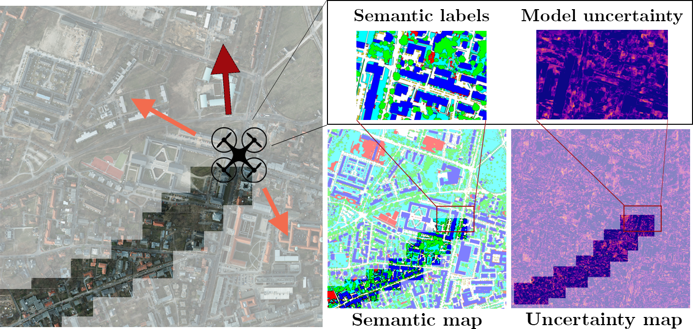
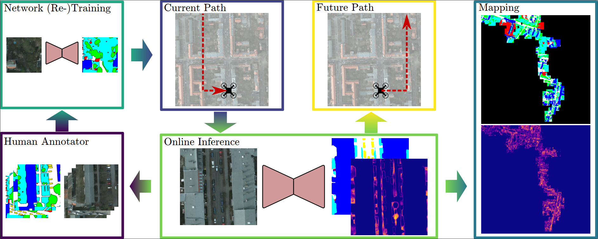

# Informative Path Planning for Active Learning in Aerial Semantic Mapping

This repository contains the code of our paper "Informative Path Planning for Active Learning in
Aerial Semantic Mapping". We propose a new approach for using unmanned aerial vehicles (UAVs) to
autonomously collect useful data for active learning.
The paper can be found [here](https://arxiv.org/pdf/2203.01652.pdf).

## Abstract

Semantic segmentation of aerial imagery is an
important tool for mapping and earth observation. However,
supervised deep learning models for segmentation rely on large
amounts of high-quality labelled data, which is labour-intensive
and time-consuming to generate. To address this, we propose
a new approach for using unmanned aerial vehicles (UAVs) to
autonomously collect useful data for model training. We exploit
a Bayesian approach to estimate model uncertainty in semantic
segmentation. During a mission, the semantic predictions and
model uncertainty are used as input for terrain mapping. A key
aspect of our pipeline is to link the mapped model uncertainty
to a robotic planning objective based on active learning. This
enables us to adaptively guide a UAV to gather the most
informative terrain images to be labelled by a human for
model training. Our experimental evaluation on real-world data
shows the benefit of using our informative planning approach
in comparison to static coverage paths in terms of maximising
model performance and reducing labelling efforts.

If you found this work useful for your own research, feel free to cite it.
```commandline
@inproceedings{ruckin2022informative,
  title={Informative Path Planning for Active Learning in Aerial Semantic Mapping},
  author={R{\"u}ckin, Julius and Jin, Liren and Magistri, Federico and Stachniss, Cyrill and Popovi{\'c}, Marija},
  booktitle={2022 IEEE/RSJ International Conference on Intelligent Robots and Systems (IROS)},
  year={2022},
  organization={IEEE}
}
```

## System Overview



Our planning strategy for active learning in UAV-based terrain mapping. During a mission, we 
estimate model uncertainty in semantic segmentation (top-right) and fuse it in a global terrain 
map (bottom-right). Based on the map, our approach guides a UAV to collect most useful (most 
uncertain) training images for labelling (left). Orange arrows indicate candidate paths and red 
shows the chosen path. In this way, our pipeline reduces the number of images that must be 
labelled by a human.



Overview of our proposed approach. We start with a pretrained network for probabilistic semantic
segmentation, deployed on a UAV. During a mission, the network processes RGB images to predict
pixel-wise semantic labels and model uncertainties, which are projected onto the ground to build 
global maps capturing these variables. Based on the estimated model uncertainty, the current UAV 
position, and the current map state, our algorithm plans paths for the UAV to collect the most 
uncertain (most informative) training data for improving the network performance. 
After the mission, the collected images are labelled by an annotator and used for network 
retraining. By guiding the UAV to collect informative training data, our pipeline reduces the 
labelling effort.

## Installation & Setup

1. Clone repo and initialize submodules:
```commandline
git clone git@github.com:dmar-bonn/ipp-al.git
cd ipp-al
git submodule update --init
pip3 install -r requirements.txt
```
2. Download and unpack the Potsdam orthomosaic [here](https://www.isprs.org/education/benchmarks/UrbanSemLab/2d-sem-label-potsdam.aspx).
3. Create a train-validation-test image split as described in the paper.
4. Pretrain a Bayesian-ERFNet model on cityscapes and save the checkpoint *erfnet_cityscapes.ckpt*.
5. Empty the *training_set/images* and *training_set/anno* folder of the Potsdam dataset folder.
6. Adapt the *path_to_orthomosaic* and *path_to_anno* attributes in your *config/config.yaml* file to the *potsdam_orthomosaic.zip* *RGB* and *Labels* absolute directory paths respectively.
7. Adapt the *path_to_dataset* in your *bayesian_erfnet/agri_semantics/config/potsdam.yaml* file to the absolute Potsdam dataset directory path.
8. Adapt the *path_to_checkpoint* in your *config/config.yaml* to the absolute *erfnet_cityscapes.ckpt* path.
9. To run the active learning pipeline, set the proper python path:
```commandline
export PYTHONPATH=$(pwd):$(pwd)/bayesian_erfnet/
python3 main.py
```

The active learning pipeline executes the number of missions specified in *config/config.yaml*.
All config files are saved to the disk. During a mission, the collected train data is saved to the disk.
After each mission, the map, the planned path, and the evaluation metrics of the retrained model
are saved to the disk.

## Development

### Style Guidelines

In general, we follow the Python [PEP 8](https://www.python.org/dev/peps/pep-0008/) style guidelines. Please install [black](https://pypi.org/project/black/) to format your python code properly.
To run the black code formatter, use the following command:

```commandline
black -l 120 path/to/python/module/or/package/
```

To optimize and clean up your imports, feel free to have a look at this solution for [PyCharm](https://www.jetbrains.com/pycharm/guide/tips/optimize-imports/).

### Maintainer

Julius Rückin, [jrueckin@uni-bonn.de](mailto:jrueckin@uni-bonn.de), Ph.D. student at [PhenoRob - University of Bonn](https://www.phenorob.de/)

## Acknowledgement

We would like to thank Matteo Sodano and Tiziano Guadagnino for help with our experiments and 
proofreading. We would like to thank Jan Weyler for providing a PyTorch Lightning implementation 
of ERFNet.

## Funding

This work was funded by the Deutsche Forschungsgemeinschaft (DFG,
German Research Foundation) under Germany’s Excellence Strategy - EXC
2070 – 390732324. Authors are with the Cluster of Excellence PhenoRob,
Institute of Geodesy and Geoinformation, University of Bonn.
